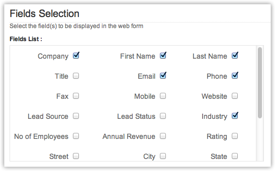
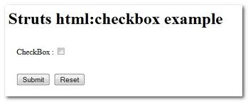

As checkboxe's são como uma escolha booleana: true ou false, sim ou não.

```html
<input type="checkbox" name="company" />
```

Normalmente vem em grupo, como a imagem abaixo.



Ou sozinha como no exemplo seguinte.




## Como as checkboxes funcionam?

Para dizer qual a checkbox foi ticada (selecionada), usamos a propriedade `checked`.

```html
<input type="checkbox" name="company" checked/>
```

Mas a especificação diz que é para ser usado dessa forma:

```html
<input type="checkbox" name="company" checked="checked"/>
```

De qualquer forma, o navegador entenderá que a __checkbox__ deve ser assinalada. Uma coisa importante de se dizer é que
a propriedade `value` é inútil. Explico, se o controle for clicado, o valor que é enviado para o servidor é `value=on`
e se NÂO clicado, o valor é `value=off`, certo??? Errado, e isso é muito triste! Quando o controle não é clicado ele
não envia nada, nada mesmo. Quando é clicado, ele envia o valor que você especificar na propriedade `value`.

Isso faz sentido para você? Pra mim não, mas tudo bem.


## Estilizando

O que mais incomoda em relação aos __checkboxes__ são a falta de alinhamento com o elemento __label__ e, obviamente,
a inconsistência entre os navegadores.

Uma forma simples de deixar a __label__ alinhado com a __checkbox__ é configurar a propriedade "alinhamento vertical"
no meio e ajustar a altura com a propriedade `top`. Para `top` funcionar, o elemento precisa estar posicionado
relativamente.

```css
input {
  margin:0 12px 0 0;
  vertical-align: middle;
  position: relative;
  top: -1px;
}
```

<a href="exemplo.html" class="btn btn-primary">Veja nosso exemplo</a>