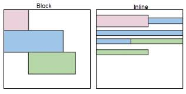
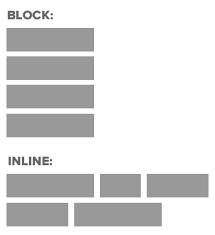

O objetivo da matéria é entender as diferênças entre os dois tipos essenciais de tags:  __in-line__ e de __block-level__.

A diferênça básica é que o browser acomoda os elementos de __bloco__ um abaixo do outro e os __inline__ à esquerda
um ao lado do outro.

Abaixo vemos um HTML com alguns elementos (tags) tanto __inline__ como __block level__.

<a href="exemplo-01.html" class="btn btn-primary">Veja exemplo-01</a>

Abaixo vemos alguns elementos básicos do tipo __block-level__:

- div
- h1, h2, h3
- p
- ul, ol
- table
- form
- fildset
- hr

... e alguns elementos __in-line__:

- span
- a
- img
- td
- label
- input
- select
- textarea

## inline-block

Há ainda um terceiro tipo de elemento: o __inline-block__ que nada mais é do que um elemento de bloco acomodado como um
elemento inline. Veja o [exemplo-02](exemplo-02.html) para entender melhor.

## Propriedade display

A CSS pode alterar o tipo do elemento, com a propriedade `display` é possível utilizar os três valores:

1. `block`
2. `inline`
3. `inline-block`

Na verdade, há mais opções, leia mais sobre a propriedade [display](/html-css/display/)!

## Dá parar inverter o comportamento 

A tag `div` é __block-level__, mas se aplicarmos o valor `inline` a propriedade `display` ela começará a se comportar como
uma tag inline. Exemplo:

    div {
        display: inline;
    }

O inverso também é verdadeiro.

A tag `span` é __inline__, mas se aplicarmos o valor `block` a propriedade `display` ela se comportará como uma tag block-level.
Exemplo:

    span {
        display: block;
    }
