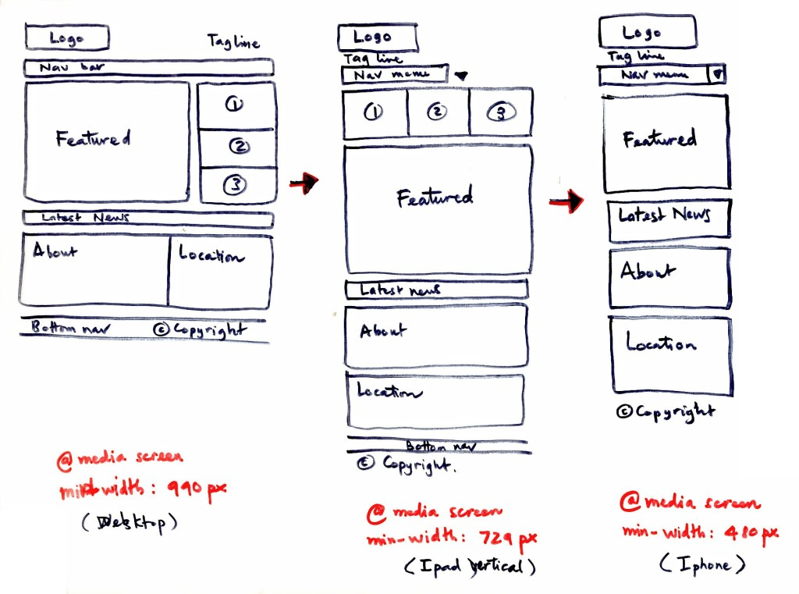
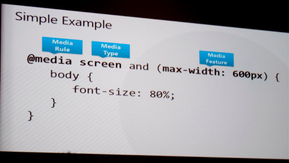
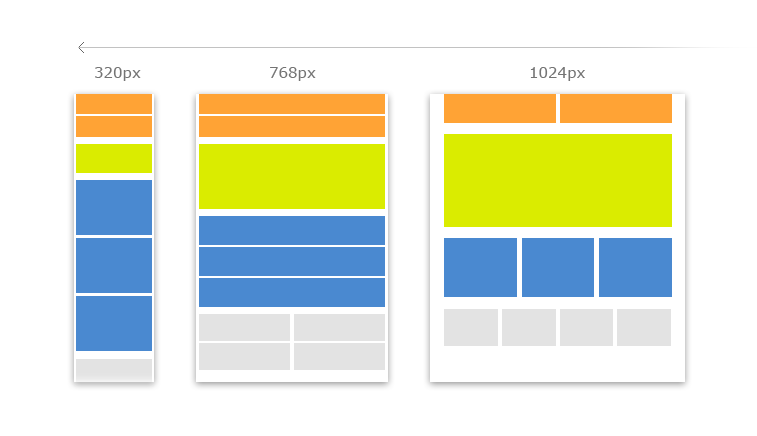

A media queries abriu a possibilidade de usar determinada folha de estilo (CSS) segundo o tamanho
e/ou tipo do disposito na qual o HTML é apresentado.

A sintaxe é relativamente simples, começamos com `@media` seguido de uma expressão, por exemplo,
`(min-width: 640px)`. Dentro desse "espaço", nos podemos escrever as regras CSS.

No exemplo abaixo nós ensinamos ao navegador a aplicar a regra CSS quando a tela do dispositivo
ultrapassar a largura de 640 pixels. Em outras palavras, mude a cor de fundo da tag `body` para
verde (green) quando a tela for maior que o temanho mínimo definido, no caso 640px.

```css
@media (min-width: 640px) {
    body {
        background: green;
    }
}
```

Na parte na qual eu me referi como sendo a "expressão", na verdade chama-se media-feature, é para você
pensar como se fosse realmente uma expressão. Pense na estrutura de controle `if`, é mais ou menos
isso...


```javascript
//
// se width for menor ou igual a 640 pixels,
//
if (width <= 640px) {
    // ... use esta regra:
    body {
        background: green;
    }
}
```

A definição formal seria "Media queries consistem de um media type e podem, a partir de uma
especificação CSS3, contendo uma ou mais expressões, expressa em media features, que determinam ou
verdadeiro ou falso. Os resultados da query são verdadeiros se o media type especificado na media
query corresponde ao tipo do documento exibido no dispositivo e todas as expressões na media query
são verdadeiras."

- media query ?
- media type ?
- media feature ?

A imagem abaixo vai nos ajudar a entender...



Nós podemos usar tanto a largura da tela como a altura. Mas eu ainda não encontrei um caso de uso
para a altura da tela.

Usamos o prefixo "min-" ou "max-" para expressar as restrições "menor ou igual" ou "maior ou igual",
respectivamente:

- min-width (menor ou igual a largura da tela)
- max-widht (maior ou igual a largura da tela)

Dito isso, podemos concluir que as media queries desenpenham um papel fundamental na técnica do
design resonsivo. Pois podemos organizar nossa CSS conforme o tamanho da tela, exemplo:




```css
/* mobile */
@media (min-width: 320px) {

}
/* tablets */
@media (min-width: 768px) {

}
/* desktop */
@media (min-width: 1024px) {

}
```


## Operadores Lógicos

Podemos utilizar `and`, `only` e `not`.


## Breakpoints

Os breakpoints são os pontos onde o layout deve quebrar. Não há um senso comum extato, mas há medidas que foram
popularizadas por alguns frameworks como o Bootstrap, por exemplo.


## type

Mas não é so tamanho que ela permite controlar. Podemos definir o tipo de media que sofrerá detreminada
estilização com CSS. Fazemos isso com
