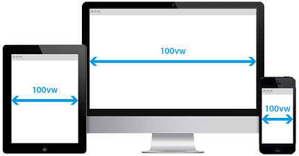

As unidades relativas `vw` (viewport width) e `vh` (viewport height) utilizam a largura e altura da viewport respectivamente.

- `vw` 1% da largura da viewport
- `vh` 1% da altura da viewport

Com elas é possível atribuir a um elemento o tamanho (seja altura, seja largura) da viewport.

    elemento {
        width: 100vw;
        height: 100vh;
    }

Essa unidade de medida é muito parecida com a unidade relativa de porcentagem `%`. É possível afirmar que 1% é igual a 
1vw, veja este [exemplo-1a](01a.html).

Mas a grande diferença é que enquanto a unidade `%` é relativa ao elemento pai, as unidades `vw` e `vh` são relativas ao
viewport. Veja este outro [exemplo-1b](01b.html), eu apliquei na primeira div `100vw` e na segunda div `100%`. Eles 
deveriam ser iguais? Você deve saber responder o porque quê que eles são diferentes ? 

Já na [exemplo-2](02.html) nos vemos a unidade `vw` aplicada ao tamanho da fonte. Abra o exemplo e altere o tamanho
de sua tela para entender o resultado. Os próximos exemplos vão nessa mesma linha, no [exemplo-3a](03a.html) eu aplico
`vw` ao tamanho da fonte. Já no [exemplo-3b](03b.html) eu aplico `vh` ao tamanho da fonte. Abra cada exemplo, mexa no
tamnanho de sua tela e tenha a certeza de ter entendido o funcionamento dessas propriedades.

Utilizar o tamanho da fonte como `vw` ou `vh` nem sempre é uma boa ideia. Abra o [exemplo-4](04.html) e diminua bem a 
tela de seu navegador. Me diga o que aconteceu com o texto ? Ficou pequeno demais, não ficou ? Você acha que conseguiria
ler esse texto na tela de seu smartphone ?

Se você precisar explorar o tamanho total da tela de seu navegador, as unidades cairão como uma luva. No [exemplo-5](05.html)
eu crio uma única seção utilizando-se do tamanho total da tela. Já no exemplo [exemplo-6](06.html) eu utilizo várias 
seções com o tamanho total da tela (role a tela). Nestes exemplos, experimente modificar o tamanho de 100 para 90 e 
para 50, ficou bom ? O que você achou ?

## vmin e vmax

- `vmin` 1% da MENOR medida entre vw e vh
- `vmax` 1% da MAIOR medida entre vw e vh

Imagine uma tela de tamanho 1024x760, quem é menor ? Quem é maior ?

Neste caso, vmin usará a medida vh (760), portanto 1vmin = 7.6 (760 / 100).

Ainda neste caso, vmax usará a medida de vw (1024), portanto 1vmax = 10.24 (1024 / 100).

Se você realemente entendeu, já está deve estar pensando "quer dizer que, se o tamanho da tela variar em altura e 
largura, ele vai utilizar hora vw e hora vh ?" Sim, isso mesmo, vai ficar meio maluco! 

No [exemplo-7a](07a.html), eu utilizei uma seção baseado no vmin.

    section {
        width: 100vmin;
        height: 100vmin;

Altere a tela tanto em altura como em largura bem devagar e tente sentir o funcionamento.

No [exemplo-07b](07b.html) eu utilizei uma seção baseado no vmax.

    section {
        width: 100vmax;
        height: 100vmax;

Repita o procedimento só que desta vez fique atento para as barras de rolagens.

<!--
https://www.webpagefx.com/blog/web-design/responsive-background-image/
-->

