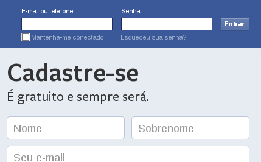

Um __formulário web__ é a porta de entrada dos dados de sua aplicação.

É nele que seu usuário faz a entrada de dados.

Abaixo, temos um exemplo de formulário.


<!DOCTYPE html PUBLIC "-//W3C//DTD XHTML 1.0 Strict//EN"
  "http://www.w3.org/TR/xhtml1/DTD/xhtml1-strict.dtd">
<html xmlns="http://www.w3.org/1999/xhtml" xml:lang="pt" >
    <head>
        <title> Nosso singelo formulário </title>
    </head>
    <body>
        <form action="script-para-onde-envio-os-dados.php" method="post">
            

                Name:  <input type="text" name="username" value="João da Silva" />
            

            

                Email: <input type="text" name="email"  value="joao@dasilva.com" />
            

            

                <input type="submit" value="Submit me!" />
            

        </form>
    </body>
</html>


O formulário pega os dados digitados pelo usuário, associa cada dado a um nome de campo e os envia ao servidor. 
Lá no outro lado (no servidor), um linguagem de servidor recebe os dados e faz alguma coisa com eles, seguindo a lógica
do script criado pelo programador.

A tag `form` é o início do formulário.


<form>

</form>


Dentro das tags `form` colocamos os controles (inputs), labels e alguns botões.

Um formulário na web normalmente é chato de se preencher, só que ele é a alma dos aplicativos web, pois é através de seus
campos que o usuário faz a inserção dos dados e, dessa forma, interaje com o sistema.

Um formulário pode (e deve) conter elementos que formam um par `nome=valor`.

Por exemplo, um __campo de entrada de texto__ (uma text box) chama-se `pais` e o seu valor é o texto `Brasil`. Quando
esse formulário submeter seus dados para o servidor, ele poderá trabalhar com a variável `pais` e seu valor será `Brasil`.

Esse negócio é tão simples que fica até difícil de explicar, rs.

Veja o famoso formulário do Facebook. Vamos analisar apenas a "tarja azul". Temos os campos `login`, `senha` e uma chekbox
 "mantanha-me conectado".

Quando o usuário preencher os dados e clicar no botão "Entrar" o servidor poderá trabalhar com os seguintes dados:

    login=email@digitado
    senha=1234
    manter=false

Essa questão da interação __formulário/servidor__ nós veremos em outro momento, ok? Aqui, no curso de HTML e CSS vamos 
nos deter apenas em seu layout e estrutura.

Fonte:

- [My first HTML form (MDN) - Exemplo básico de formulário web](https://developer.mozilla.org/en-US/docs/Web/Guide/HTML/Forms/My_first_HTML_form "link-externo")

