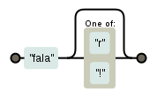

Metacaracter ponto .
---

O ponto casa com qualquer coisa.

O ponto é um curinga para casar um caractere

A expressão `e.tendido` casa com `estendido`, `extendido`, `eztendido` e etc...

Veja mais sobre o [metacaracter ponto](../metacaracter-ponto/)

Metacaracter lista [ ]
---

A lista casa com quem ela conhece e tem suas próprias regras.

A expressão `[tT]eclado` casa com `teclado` e `Teclado`.

Veja mais sobre o [metacaracter lista](../metacaracter-lista/)

Metacaracter lista negada [^]
---

Ela casará com qualquer coisa fora os componentes listados.

Exemplo, a expressão regular `[^0-9]` casa com qualquer coisa menos os números.

Veja mais sobre o [metacaracter lista negada](../metacaracter-lista-negada/)

Metacaracter opcional ?
---

O opcional é um quantificador indica que pode ter ou não a ocorrência da entidade anterior, pois ele a repete 0 ou 1 vez.

A expressão `fala[r!]?` casa com `fala`, `fala!` e `falar`.

Veja mais sobre o [metacaracter opcional](../metacaracter-opcional/)

Metacaracter *	asterisco
---

O asterisco repete em qualquer quantidade

A expressão `6*0` casa com `0`, `60`, `660`, `6660`, `6666666666660`.

Veja mais sobre o [metacaracter asterisco](../metacaracter-asterisco/)

Metacaracter +	mais
---

O mais tem funcionamento idêntico ao do asterisco, a única diferença é que o mais não é opcional, então a entidade 
anterior deve casar pelo menos uma vez, e pode ter várias.

A expressão `6+0` casa com `60`, `660`, `6660`, `6666666666660`.

Veja mais sobre o [metacaracter mais](../metacaracter-mais/)

Metacaracter {}	chaves
---

Metacaracter ^	circunflexo
---

Metacaracter $	cifrão
---

Metacaracter \b	borda
---

Metacaracter \	escape
---

Metacaracter |	ou
---

Metacaracter ()	grupo
---

Metacaracter \1	retrovisor
---

